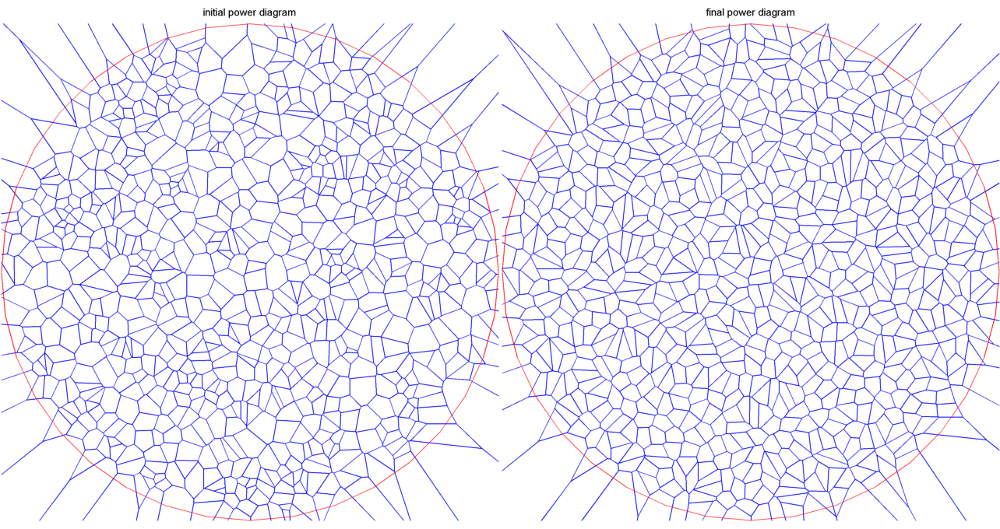

Optimal Mass Transport
---------------------------
Implement 2D optimal mass transport map based on theory in [Gu]. Domain can be unit circle or disk. Source measure is continuous, target measure is discrete. 

## Example:
Initial power digram is generated from random points, target area is set to 1/num_of_cells on all cells. left is initial power diagram, right is final power diagram.

See demo*.m for more examples.

## Dependency:
* [geometry-processing-package][GPP]
* [geom2d][geom2d]
* [polybool_cliper][polybool] Matlab comes with a polybool in Mapping Toolbox, however I don't have that. Usage is not identical with Matlab's polybool
* [export_fig][export_fig] (optional, use to generate fig)

   [Gu]: <http://arxiv.org/pdf/1302.5472v1>
   [GPP]: <https://bitbucket.org/group-gu/geometry-processing-package.git> 
   [export_fig]: <https://github.com/altmany/export_fig.git>
   [geom2d]: <http://www.mathworks.com/matlabcentral/fileexchange/7844-geom2d>
   [polybool]: <https://sites.google.com/site/ulfgri/numerical/polybool>