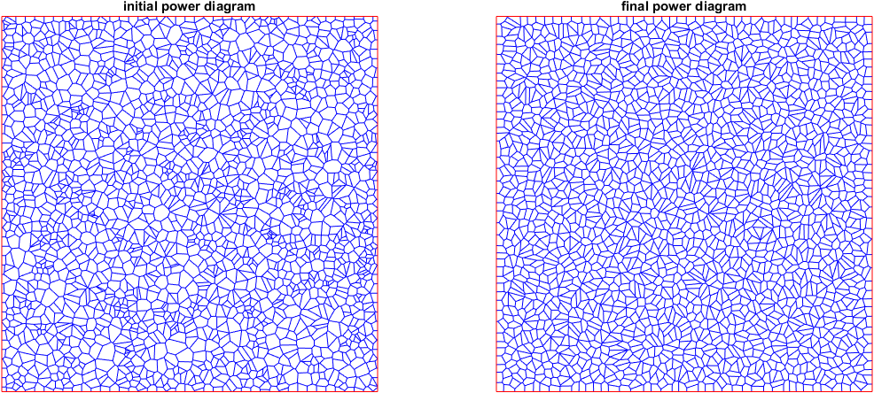

Optimal Mass Transport
---------------------------
Implement 2D optimal mass transport map based on theory in [Gu]. Domain can be unit circle or disk. Source measure is continuous, target measure is discrete. 

## Example:
Initial power digram is generated from random points, target area is set to 1/num_of_cells on all cells. left is initial power diagram, right is final power diagram.

See demo*.m for more examples.

## Dependency:
* [geometry-processing-package][GPP] (download manually)
* [geom2d][geom2d]
* [polybool_cliper][polybool] replace Matlab's builtin functions polybool and polyarea
* [export_fig][export_fig] (optional, use to generate fig)

   [Gu]: <http://dx.doi.org/10.4310/AJM.2016.v20.n2.a7>
   [GPP]: <https://github.com/group-gu/geometry-processing-package> 
   [export_fig]: <https://github.com/altmany/export_fig>
   [geom2d]: <https://github.com/dlegland/matGeom>
   [polybool]: <https://github.com/group-gu/polybool_clipper>